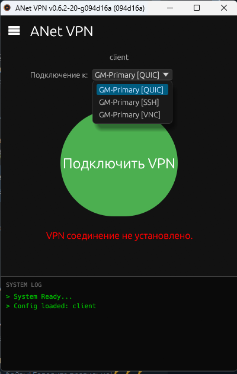
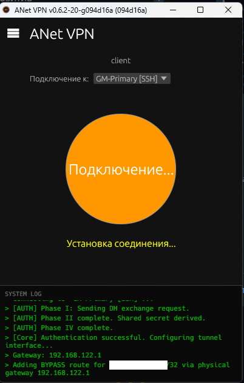
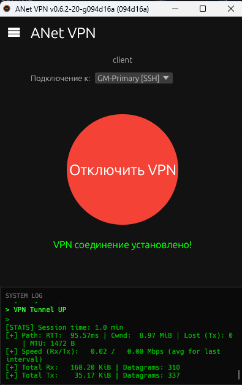

# ANet: Сеть Друзей


**ANet** — это инструмент для организации приватного, защищенного информационного пространства между близкими людьми. Мы строим цифровые мосты там, где обычные пути недоступны.

Это не сервис. Это технология для связи тех, кто доверяет друг другу.

## Особенности

В основе проекта лежит собственный транспортный протокол **ASTP (ANet Secure Transport Protocol)**, разработанный с фокусом на:

*   **Приватность:** Полное сквозное шифрование (ChaCha20Poly1305 / X25519).
*   **Устойчивость:** Стабильная работа в сетях с высокими потерями пакетов и нестабильным соединением.
*   **Мимикрия:** Транспортный уровень неотличим от случайного шума (High-entropy UDP stream).
*   **Кроссплатформенность:** Клиенты для Linux, Windows и Android.

## Структура проекта

Проект написан на Rust и разделен на модули:

*   `anet-auth` — Узел координации.
*   `anet-server` — Сам сервер (может работать без `anet-auth`).
*   `anet-client-core` — Непосредственно клиент.
*   `anet-client-cli` — Консольный клиент для Linux/Headless систем.
*   `anet-client-gui` — Графический клиент (Windows/Linux) с минималистичным интерфейсом.
*   `anet-mobile` — Библиотека и JNI-биндинги для Android.
*   `anet-common` — Реализация протокола ASTP и криптографии.
*   `anet-keygen` — Утилита для генерации ключей доступа.
*   `anet-webui` — Админ панель.

Как мог накидал: [Документацию](./contrib/docs/anet.ru.md)

А это уже полностью нейронка: [AUTH HTTP API](./contrib/docs/http.api.ru.md)

## Сборка

Требуется установленный Rust (cargo).

```bash
# Сборка всех компонентов
make all

# Сборка статичных бинарников с musl
make musl

# Сборка библиотеки для Android
make mob

# Сборка под macOS
# Build macOS CLI client
make macos

# Build macOS GUI client
make macos-gui

# Build universal macOS binaries (Intel + Apple Silicon)
make macos-universal

# Генерация сертификата для QUIC
make cert
```
[Android src](https://github.com/ZeroTworu/anet-android)

[TG Channel](https://t.me/anet_org)

[Donate](https://dalink.to/anet_project)

Тут некто [Lisenblsh](https://github.com/Lisenblsh) завернул всё это в docker - [anet-docker](https://github.com/Lisenblsh/anet-docker)

Лично я не проверял, но с первого взгляда выглядит нормально.

**WARNINING!**

Это не мой друг-знакомый, так что "на свой страх и риск", обсуждение [тут](https://github.com/ZeroTworu/anet/issues/36).

## Скриншоты интерфейса (anet-client-gui)

<p align="center">



</p>
